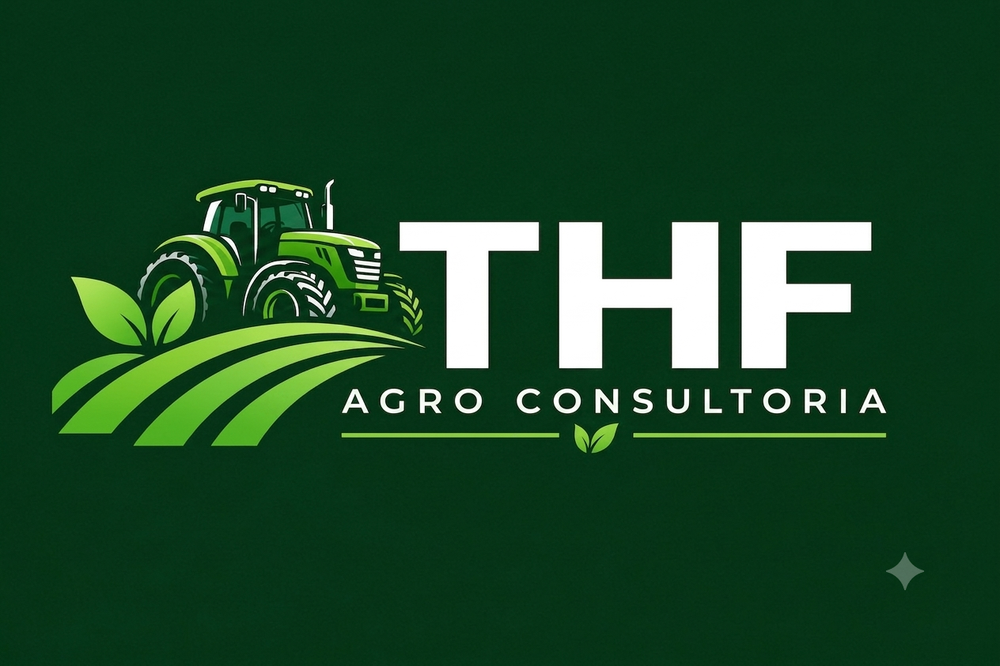

<html lang="pt-BR">
<head>
    <meta charset="UTF-8">
    <meta name="viewport" content="width=device-width, initial-scale=1.0">
    <title>THF Agro Consultoria</title>

    <!-- Google Fonts -->
    <link rel="preconnect" href="https://fonts.googleapis.com">
    <link rel="preconnect" href="https://fonts.gstatic.com" crossorigin>
    <link href="https://fonts.googleapis.com/css2?family=Montserrat:wght@400;600;700;800&family=Open+Sans:wght@300;400;600&display=swap" rel="stylesheet">

    <!-- Font Awesome Icons -->
    <link rel="stylesheet" href="https://cdnjs.cloudflare.com/ajax/libs/font-awesome/6.4.0/css/all.min.css">

    
</head>

<body>

    <!-- Botão Flutuante de Agendamento via WhatsApp -->
    <a href="https://wa.me/5514999010120?text=Ol%C3%A1!%20Gostaria%20de%20agendar%20uma%20consultoria%20com%20a%20THF%20Agro." target="_blank" class="whatsapp-float">
        <i class="fa-brands fa-whatsapp"></i> Agendar Atendimento
    </a>

    <!-- Header -->
    <header>
        
        <nav>
            <ul>
                <li><a href="#sobre">Quem Somos</a></li>
                <li><a href="#proposito">Propósito</a></li>
                <li><a href="#atuacao">Atuação</a></li>
                <li><a href="#clientes">Clientes</a></li>
                <li><a href="#diferenciais">Diferenciais</a></li>
                <li><a href="#metodologia">Como Trabalhamos</a></li>
                <li><a href="#contato" class="btn-contact">Contato</a></li>
            </ul>
        </nav>
    </header>

    <!-- Hero Section -->
    <section class="hero">
        

            <h1>THF AGRO CONSULTORIA</h1>
            
Gestão, conformidade e sustentabilidade para o Agronegócio

            

                
<i class="fa-solid fa-leaf"></i> Meio Ambiente

                
<i class="fa-solid fa-users"></i> Trabalho Rural

                
<i class="fa-solid fa-barcode"></i> Rastreabilidade

                
<i class="fa-solid fa-handshake"></i> Relações Comerciais

            

            

                <a href="https://wa.me/5514999010120?text=Ol%C3%A1!%20Gostaria%20de%20agendar%20uma%20consultoria%20com%20a%20THF%20Agro." target="_blank" class="btn-schedule">
                    <i class="fa-brands fa-whatsapp"></i> Agendar Consultoria no WhatsApp
                </a>
            

        

    </section>

    <!-- Quem Somos -->
    <section id="sobre">
        

            

                

                    <h2>Quem Somos</h2>
                

                
A <strong>THF Agro Consultoria</strong> nasce para apoiar produtores, empresas e organizações do agronegócio na gestão de riscos, conformidade socioambiental e rastreabilidade.

                
Conectamos produção, legislação, sustentabilidade e segurança para tornar operações rurais mais seguras, transparentes e preparadas para as exigências do mercado global e nacional.

                

                    

                        <h4>Gestão de Riscos</h4>
                        
Mitigação proativa de passivos ambientais e trabalhistas.

                    

                    

                        <h4>Transparência</h4>
                        
Cadeias produtivas rastreáveis da origem ao consumidor final.

                    

                

            

            

                
            

        

    </section>

    <!-- Propósito (MVV) -->
    <section id="proposito" class="mvv-section">
        

            <h2>Propósito da Empresa</h2>
            
Nossa visão estratégica direcionada para o desenvolvimento do setor rural

        

        

            

                
<i class="fa-solid fa-bullseye"></i>

                <h3>Missão</h3>
                
Oferecer soluções de consultoria que promovam conformidade, transparência, sustentabilidade e eficiência nas atividades do Agronegócio, gerando valor de mercado.

            

            

                
<i class="fa-solid fa-eye"></i>

                <h3>Visão</h3>
                
Ser referência em consultoria agroambiental e de conformidade, contribuindo para um agronegócio brasileiro mais responsável, rastreável e competitivo.

            

            

                
<i class="fa-solid fa-seedling"></i>

                <h3>Valores</h3>
                
Integridade nas relações, rigor técnico nas análises, respeito ao produtor rural e compromisso com o desenvolvimento sustentável do campo.

            

        

        

            <h3>Propósito Central</h3>
            
“Transformar conformidade em valor para o Agronegócio.”

        

    </section>

    <!-- Áreas de Atuação -->
    <section id="atuacao">
        

            <h2>Áreas de Atuação</h2>
            
Soluções integradas cobrindo os pilares fundamentais do agronegócio moderno

        

        

            <!-- 01 Meio Ambiente -->
            

                

                    Área 01
                    
                

                

                    <h3>Meio Ambiente</h3>
                    
Gestão ambiental aplicada à realidade do campo

                    <ul class="service-list">
                        <li><i class="fa-solid fa-check-circle"></i> Controle e monitoramento do uso da terra</li>
                        <li><i class="fa-solid fa-check-circle"></i> Avaliação de reservas legais e áreas protegidas</li>
                        <li><i class="fa-solid fa-check-circle"></i> Prevenção e identificação de riscos de desmatamento</li>
                        <li><i class="fa-solid fa-check-circle"></i> Verificação de conformidade ambiental</li>
                        <li><i class="fa-solid fa-check-circle"></i> Adequação às normas e leis de proteção ambiental</li>
                    </ul>
                

            

            <!-- 02 Trabalho Rural -->
            

                

                    Área 02
                    
                

                

                    <h3>Trabalho Rural</h3>
                    
Pessoas protegidas. Operações mais seguras

                    <ul class="service-list">
                        <li><i class="fa-solid fa-check-circle"></i> Avaliação das condições de trabalho</li>
                        <li><i class="fa-solid fa-check-circle"></i> Verificação de requisitos de saúde e segurança</li>
                        <li><i class="fa-solid fa-check-circle"></i> Identificação de riscos trabalhistas</li>
                        <li><i class="fa-solid fa-check-circle"></i> Prevenção de condições degradantes</li>
                        <li><i class="fa-solid fa-check-circle"></i> Boas práticas de gestão de pessoas no meio rural</li>
                    </ul>
                

            

            <!-- 03 Rastreabilidade -->
            

                

                    Área 03
                    
                

                

                    <h3>Rastreabilidade</h3>
                    
Da origem ao consumidor final

                    
A THF auxilia na construção de processos capazes de demonstrar a origem, trajetória e conformidade dos produtos ao longo de toda a cadeia produtiva.

                    

                        Origem
                        <i class="fa-solid fa-chevron-right flow-arrow"></i>
                        Produção
                        <i class="fa-solid fa-chevron-right flow-arrow"></i>
                        Controle
                        <i class="fa-solid fa-chevron-right flow-arrow"></i>
                        Transporte
                        <i class="fa-solid fa-chevron-right flow-arrow"></i>
                        Consumidor
                    

                

            

            <!-- 04 Relações Comerciais -->
            

                

                    Área 04
                    
                

                

                    <h3>Relações Comerciais</h3>
                    
Integridade que protege o seu negócio

                    <ul class="service-list">
                        <li><i class="fa-solid fa-check-circle"></i> Prevenção de fraudes</li>
                        <li><i class="fa-solid fa-check-circle"></i> Avaliação de conflitos de interesse</li>
                        <li><i class="fa-solid fa-check-circle"></i> Análise de riscos em relações comerciais</li>
                        <li><i class="fa-solid fa-check-circle"></i> Apoio à integridade em contratos</li>
                        <li><i class="fa-solid fa-check-circle"></i> Avaliação de fornecedores e compras de insumos</li>
                    </ul>
                

            

            <!-- 05 Crédito Rural e Financiamento -->
            

                

                    Área 05
                    
                

                

                    <h3>Crédito Rural e Financiamento</h3>
                    
Captação e estruturação financeira para a sua produção

                    <ul class="service-list">
                        <li><i class="fa-solid fa-check-circle"></i> Elaboração de projetos técnicos para custeio e investimento</li>
                        <li><i class="fa-solid fa-check-circle"></i> Enquadramento em linhas oficiais de crédito (Pronaf, Pronamp, Moderfrota, etc.)</li>
                        <li><i class="fa-solid fa-check-circle"></i> Análise de viabilidade financeira de expansão e modernização</li>
                        <li><i class="fa-solid fa-check-circle"></i> Assessoria no relacionamento com bancos e cooperativas de crédito</li>
                        <li><i class="fa-solid fa-check-circle"></i> Otimização de prazos e taxas adequadas ao ciclo produtivo</li>
                    </ul>
                

            

            <!-- 06 Renegociação de Dívidas Rurais -->
            

                

                    Área 06
                    
                

                

                    <h3>Renegociação de Dívidas Rurais</h3>
                    
Reestruturação de débitos e segurança do patrimônio

                    <ul class="service-list">
                        <li><i class="fa-solid fa-check-circle"></i> Diagnóstico e revisão de contratos e débitos agropecuários</li>
                        <li><i class="fa-solid fa-check-circle"></i> Pedidos de prorrogação e alongamento de dívidas rurais (Manual de Crédito Rural)</li>
                        <li><i class="fa-solid fa-check-circle"></i> Intermediação técnica e negociação proativa com credores</li>
                        <li><i class="fa-solid fa-check-circle"></i> Readequação do fluxo de caixa e capacidade real de pagamento</li>
                        <li><i class="fa-solid fa-check-circle"></i> Proteção patrimonial e mitigação de riscos judiciais</li>
                    </ul>
                

            

        

    </section>

    <!-- Perfis de Clientes -->
    <section id="clientes">
        

            <h2>Perfis de Clientes</h2>
            
Atendemos diferentes elos da cadeia produtiva com soluções sob medida

        

        

            

                
<i class="fa-solid fa-wheat-awn"></i>

                <h3>Produtores Rurais</h3>
                
Pequenos, médios e grandes produtores que buscam adequação ambiental, conformidade trabalhista e acesso a mercados mais exigentes.

            

            

                
<i class="fa-solid fa-industry"></i>

                <h3>Agroindústrias e Tradings</h3>
                
Empresas que necessitam de rigor no controle de fornecedores, rastreabilidade de matéria-prima e mitigação de riscos reputacionais.

            

            

                
<i class="fa-solid fa-building-columns"></i>

                <h3>Investidores e Instituições Financeiras</h3>
                
Organizações que demandam auditorias socioambientais e análise de conformidade legal para concessão de crédito ou investimentos no setor.

            

        

    </section>

    <!-- Diferenciais -->
    <section id="diferenciais" class="differentials-section">
        

            <h2>Nossos Diferenciais</h2>
            
O que nos torna o parceiro ideal para a transformação sustentável do seu negócio

        

        

            

                
<i class="fa-solid fa-microscope"></i>

                <h3>Rigor Técnico</h3>
                
Metodologias analíticas consolidadas e alinhadas às legislações nacionais e internacionais.

            

            

                
<i class="fa-solid fa-compass-drafting"></i>

                <h3>Abordagem Prática</h3>
                
Soluções viáveis e adaptadas à rotina real do campo, focadas na aplicabilidade direta.

            

            

                
<i class="fa-solid fa-shield-halved"></i>

                <h3>Segurança Jurídica</h3>
                
Minimização proativa de passivos, autuações e riscos trabalhistas e socioambientais.

            

            

                
<i class="fa-solid fa-chart-line"></i>

                <h3>Geração de Valor</h3>
                
Transformamos exigências de conformidade em vantagem competitiva e reputacional no mercado.

            

        

    </section>

    <!-- Como Trabalhamos -->
    <section id="metodologia" class="process-section">
        

            <h2>Como Trabalhamos</h2>
            
Uma abordagem metodológica clara e orientada para resultados sustentáveis

        

        

            

                
01

                

                    <h3>Diagnóstico</h3>
                    
Entender profundamente a operação do cliente e mapear seus pontos críticos.

                

            

            

                
02

                

                    <h3>Avaliação de Riscos</h3>
                    
Identificar e mensurar riscos ambientais, sociais e comerciais associados ao negócio.

                

            

            

                
03

                

                    <h3>Plano de Ação</h3>
                    
Priorizar medidas de correção e melhoria, definindo prazos e responsáveis.

                

            

        

    </section>

    <!-- Footer -->
    <footer id="contato">
        

            

                

                    
                

                
Gestão de riscos, conformidade socioambiental e rastreabilidade para o Agronegócio.

            

            

                <h4>Navegação</h4>
                <ul>
                    <li><a href="#sobre">Quem Somos</a></li>
                    <li><a href="#proposito">Propósito</a></li>
                    <li><a href="#atuacao">Atuação</a></li>
                    <li><a href="#clientes">Clientes</a></li>
                    <li><a href="#diferenciais">Diferenciais</a></li>
                    <li><a href="#metodologia">Como Trabalhamos</a></li>
                </ul>
            

            

                <h4>Contato</h4>
                
<i class="fa-solid fa-envelope"></i> THF.Consultoria@gmail.com 

                
<i class="fa-solid fa-phone"></i> 14 99901-0120 

            

        

        

            
&copy; 2026 THF Agro Consultoria. Todos os direitos reservados.

        

    </footer>

</body>
</html>
